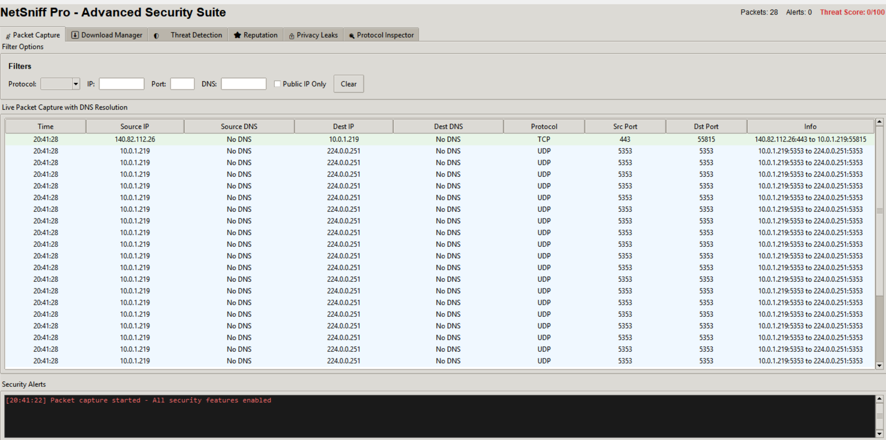

# 🛡️ NetSniff Pro - Advanced Security Suite



## A comprehensive network security monitoring and analysis platform with real-time threat detection, download management, and privacy leak monitoring.

---

## 🌟 Features

### 📡 **Core Capabilities**

- **Live Packet Capture** - Real-time monitoring of network traffic with DNS resolution
- **Advanced Filtering** - Filter by protocol, IP, port, DNS, and public IP traffic
- **Security Alerts** - Instant notifications for suspicious activity and threats
- **CSV Export** - Export captured packets for further analysis

### 🛡️ **Security Features**

- **Threat Detection** - Behavioral analysis based on connection patterns and port usage
- **Download Manager** - Secure file downloads with VirusTotal integration
- **Privacy Leak Detection** - Monitor plain-text transmission of credentials and sensitive data
- **Reputation System** - Track and score IPs and domains based on behavior
- **Protocol Inspector** - Deep HTTP/HTTPS traffic analysis

### 🔒 **Advanced Protection**

- Real-time malware scanning with VirusTotal API
- Automatic blocking of suspicious domains and IPs
- Detection of suspicious port usage (4444, 5555, 6666, 12345, 31337, etc.)
- SSL certificate verification
- File hash calculation and verification

---

## 🚀 Quick Start with UV

### Windows

1. **Install uv using WinGet:**
   ```bash
   winget install --id=astral-sh.uv -e
   ```

### Linux / macOS

- **Install via standalone script:**
  ```bash
  curl -LsSf https://astral.sh/uv/install.sh | sh
  ```
- **Or with pipx:**
  ```bash
  pipx install uv
  ```

---

## ⏬ Project Setup (All Platforms)

1. **Clone the repository:**

   ```bash
   git clone <repository-url>
   cd netsniff-pro
   ```

2. **Set up Python environment and dependencies:**

   ```bash
   uv venv
   uv pip install -r requirements.txt
   ```

3. **Configure VirusTotal API (Optional but Recommended):**

   - Create a `.env` file in the project root
   - Add your VirusTotal API key:
     ```
     VIRUSTOTAL_API_KEY=your_key_here
     ```
   - Get a free API key at [VirusTotal](https://www.virustotal.com/gui/join-us)

4. **Run the application:**
   ```bash
   uv run main_modular.py
   ```

---

## 📦 Project Structure

| File                        | Description                                 |
| --------------------------- | ------------------------------------------- |
| `main_modular.py`           | Main application launcher and coordinator   |
| `network_utils.py`          | Network utilities and packet capture engine |
| `security_manager.py`       | Core security analysis and threat detection |
| `data_manager.py`           | Packet storage, filtering, and export logic |
| **Tab Modules:**            |                                             |
| `tab_packet_capture.py`     | Live packet capture and filtering UI        |
| `tab_download_manager.py`   | Secure download management with scanning    |
| `tab_threat_detection.py`   | Threat analysis and visualization           |
| `tab_reputation.py`         | IP and domain reputation tracking           |
| `tab_privacy_leak.py`       | Privacy leak detection and monitoring       |
| `tab_protocol_inspector.py` | HTTP/HTTPS protocol analysis                |
| `requirements.txt`          | Python dependencies                         |
| `.env`                      | Configuration file (API keys)               |

---

## 🎯 Key Features Breakdown

### 1️⃣ **Packet Capture Tab**

- Real-time packet monitoring with DNS resolution
- Advanced filtering: protocol, IP, port, DNS name
- Color-coded protocol visualization (TCP, UDP, ICMP)
- Suspicious port detection and alerts

### 2️⃣ **Download Manager Tab**

- **Detected Downloads:** Automatically captures file downloads from network traffic
- **Manual Downloads:** Secure download interface with:
  - Pre-download URL scanning with VirusTotal
  - Real-time progress monitoring
  - Automatic threat blocking (configurable)
  - File hash verification
  - Speed monitoring

### 3️⃣ **Threat Detection Tab**

- Behavioral threat analysis
- Threat scoring system (0-100)
- Classification: LOW, MEDIUM, HIGH severity
- Historical threat tracking
- Detailed threat reasoning

### 4️⃣ **Reputation System Tab**

- **IP Reputation:** Track and score IP addresses
- **Domain Reputation:** Monitor domain behavior
- Dynamic scoring based on activity
- Trusted/Suspicious/Blocked classification

### 5️⃣ **Privacy Leak Detector Tab**

- Monitors plain-text credential transmission
- Detects keywords: password, token, api_key, secret, etc.
- Severity classification (HIGH/MEDIUM)
- Real-time alerts for sensitive data exposure

### 6️⃣ **Protocol Inspector Tab**

- HTTP/HTTPS request/response monitoring
- User-Agent tracking
- URL analysis
- Protocol statistics and encryption ratios

---

## 🔧 Building Standalone Executable

Build a standalone `.exe` for Windows:

```bash
uv pip install pyinstaller
pyinstaller main_modular.spec
```

The executable will be created in the `dist/` folder.

---

## 🛠️ Usage Notes

- **Administrator/Root Access:** Required for full packet capture capabilities
- **VirusTotal API:** Optional but highly recommended for download scanning
- **Network Interface:** Automatically detects and uses the active network interface
- **Data Export:** All captured packets can be exported to CSV format
- **Real-time Monitoring:** All statistics and alerts update in real-time

---

## 🔐 Security & Privacy

- **No Data Collection:** All analysis happens locally on your machine
- **API Keys:** Stored securely in `.env` file (never committed to version control)
- **Privacy First:** Download scanning is optional and can be disabled
- **Transparent:** All source code is open and auditable

---

## 🚧 Future Enhancements

> **Roadmap:**
>
> - ML-based anomaly detection for advanced threat identification
> - Integration with multiple threat intelligence feeds
> - Network topology visualization
> - Custom rule engine for threat detection
> - Extended protocol support (FTP, SMTP, SSH)
> - Packet replay and analysis tools
> - Export to multiple formats (JSON, PCAP)

---

## 📋 Requirements

- Python 3.8+
- Administrator/Root privileges (for packet capture)
- Windows: Npcap or WinPcap installed
- Linux: libpcap installed
- macOS: Built-in packet capture support

### Key Dependencies:

- `scapy` - Packet capture and analysis
- `tkinter` - GUI framework
- `python-dotenv` - Environment configuration
- `urllib3` - HTTP requests for API calls

---

---

**Happy monitoring! 🔍🛡️**
