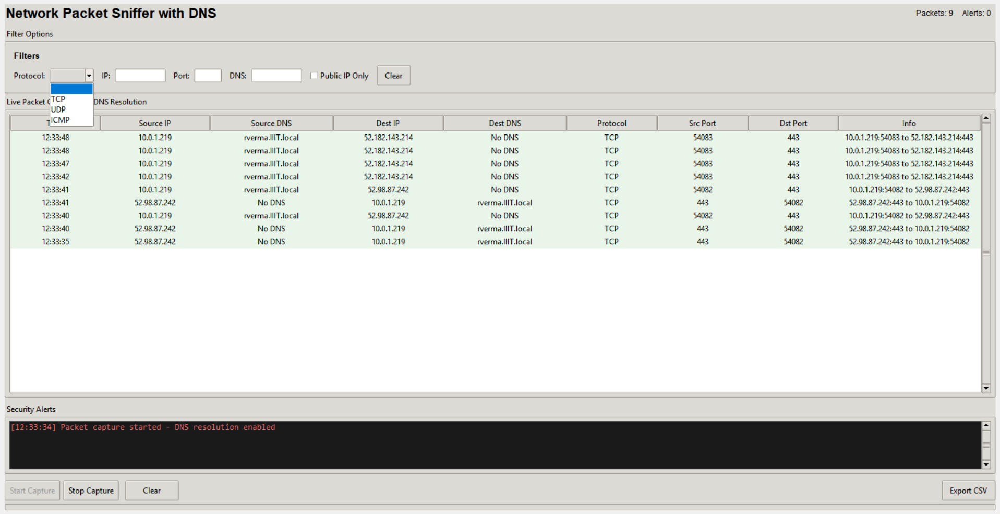

# 🛡️ NetSniff A Lightweight GUI-Based Packet Analyzer and Intrusion Detection Tool for Public IP Monitoring

## A modern, easy-to-use network packet sniffer and analyzer. Visualize live traffic, get real-time alerts for suspicious activity, and export your data. Built for clarity, speed, and extensibility.

## 🚀 Quick Start with UV

### Windows

1. **Install uv using WinGet:**
   winget install --id=astral-sh.uv -e

2. **Continue as below for all platforms:**

### Linux / macOS

- **Install via standalone script:**
  curl -LsSf https://astral.sh/uv/install.sh | sh

- **Or with pipx:**
  pipx install uv

---

## ⏬ Project Setup (all platforms)

1. **Set up Python and dependencies:**
   uv venv
   uv pip install -r requirements.txt

2. **Run the app:**
   uv run main.py

---

## 📦 Project Structure

| File               | Description                                       |
| ------------------ | ------------------------------------------------- |
| `main.py`          | Launches and manages the NetSniff Pro application |
| `network_utils.py` | Network and packet capture utilities              |
| `ui_components.py` | All UI widgets and elements                       |
| `data_manager.py`  | Packet storage, export, and filter logic          |
| `requirements.txt` | All runtime dependencies                          |

---

## 🧩 Features

- Live capture and display of IP/TCP/UDP/ICMP packets
- Filters for protocol, IP, port, and public IP traffic
- Real-time security alerts for suspicious traffic
- CSV export of captured packets
- Modern and readable interface
- Modular, maintainable codebase

---

## 🛠️ Future Enhancements

> **Next:**  
> Integrate advanced AI-assisted (aai) tools for better intrusion detection and deeper port/protocol analysis.

Ideas:

- Use AI/ML models for anomaly detection and traffic classification
- Smart port intelligence and risk ranking
- Integration with open source threat intelligence feeds

---

## 🏁 Usage Notes

- Run as administrator/root for full packet capture.
- For any issues, suggestions, or to contribute, open an issue or PR.
- We also have provided an exe to check the implementation locally

---

**Happy sniffing!**
